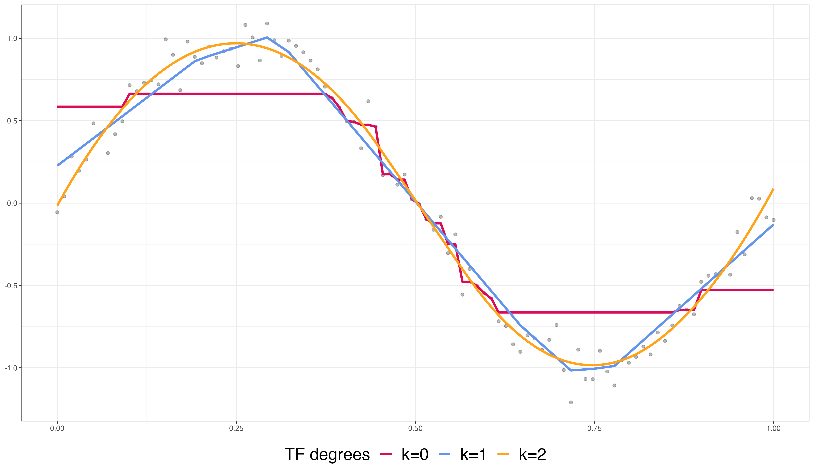

```{r setup, include=FALSE}
library(tidyverse)
library(lubridate)
library(fontawesome)
options(htmltools.dir.version = FALSE)
knitr::opts_chunk$set(
  dev = "svg",
  fig.path = "gfx/",
  fig.align = "center",
  fig.width = 9, fig.height = 3.5, fig.retina = 3,
  fig.showtext = TRUE,
  out.width = "100%",
  cache = TRUE,
  autodep = TRUE,
  echo = FALSE,
  message = FALSE,
  warning = FALSE,
  hiline = TRUE
)
```

```{r xaringan-themer, include=FALSE, warning=FALSE}
library(xaringanthemer)
primary <- "#002145"
secondary <- "#6495ed"
tertiary <- "#ffa319"
fourth_color <- "#DB0B5B"

style_duo_accent(
  primary_color = primary, # "#002145", # UBC primary
  secondary_color = secondary, # "6EC4E8", # UBC secondary 4
  header_font_google = google_font("EB Garamond"),
  text_font_google = google_font("Open Sans"),
  code_font_google = google_font("Fira Mono"),
  text_color = primary,
  table_row_even_background_color = lighten_color(primary, 0.8),
  colors = c(
    tertiary = tertiary, fourth_color = fourth_color,
    light_pri = lighten_color(primary, 0.8),
    light_sec = lighten_color(secondary, 0.8),
    light_ter = lighten_color(tertiary, 0.8),
    light_fou = lighten_color(fourth_color, 0.8)
  ),
  outfile = here::here("src/xaringan-themer.css")
)
# theme_set(theme_xaringan())
```

layout: true

---

background-image: url("gfx/ptf-graph.png")
background-size: contain
background-position: bottom

.center[# Topics in Trend Filtering with Poisson Loss]

.pull-left[
#### Author & Presenter: Jiaping(Olivia) Liu
#### Supervisor: Dr. Daniel J. McDonald
]

.pull-right[
#### Department of Statistics, UBC
#### June 13, 2023
]

<br/><br/><br/><br/><br/><br/><br/><br/><br/><br/>

---

## Trend filtering is locally adaptive.

<div style="display: flex; justify-content: left;">
  
</div>

<p style="text-align: center; font-size: 25px;">
  <span style="color: blue;"><b>Cubic trend filtering (df=6)</b></span>  v.s. <span style="color: orange;"><b>Cubic smoothing splines (df=6 <i>left</i>, 20 <i>right</i>)</b></span>
</p> 

---

## Trend filtering is piecewise-polynomial.

<div style="display: flex; justify-content: center;">
  
</div>

$\DeclareMathOperator*{\argmin}{argmin}$
$\DeclareMathOperator*{\Lambert}{Lambert_0}$
---

## Trend filtering is piecewise-polynomial.


The $k$th degree _univariate_ trend filtering is defined as:
$$
\hat{\theta} = \underset{\theta \in \mathbb{R}^n }{\argmin} \frac{1}{2} {\left\lVert y - \theta \right\rVert}_2^2 + \lambda {\left\lVert \color{orange}{D^{(k+1)}} \theta \right\rVert}_1.
$$
- Divided difference matrix $\color{orange}{D^{(k+1)}}$ constructs the polynomial curves.

- $\ell_1$ norm introduces <b>sparsity</b>.

--

<span style="font-size: 30px;"> **A simple example:** </span>

- $|D^{(1)}\theta| = (|\theta_1-\theta_2|, ... , |\theta_4 - \theta_5|)$ and $|D^{(2)}\theta| = (|\theta_1-2\theta_2 + \theta_3|, ..., |\theta_3 -2\theta_4 +\theta_5|)$.

- $D^{(1)}$ and $D^{(2)}$ are respectively
.pull-left[
```{r}
mat <- diff(diag(5))
print(mat)
```
]
.pull-right[
```{r}
mat <- diff(diff(diag(5)))
print(mat)
```
]


---

## Trend filtering for Poisson data on graphs?

- Poisson data are:

  - counts, e.g., Covid-19 infection counts, pixels of images, and crime numbers.

  - heteroskedastic.

--

- Graphs, e.g., image grids, area maps.

.pull-left[
<div style="display: flex; justify-content: right;">
  
</div>
]

.pull-right[
<div style="display: flex; justify-content: left;">
  
</div>
]

---

## Poisson trend filtering (PTF) on graphs 

TF with Poisson loss on graphs is defined as
\begin{equation}
        \hat{\theta} = \underset{\theta \in \mathbb{R}^n }{\argmin} \frac{1}{n}\sum_{i=1}^n -y_i\theta_i + e^{\theta_i} + \lambda {\left\lVert \Delta^{(k+1)} \theta\right\rVert}_1.
\end{equation}

--

<span style="font-size: 25px;"> **A simple example:** </span>

.pull-left-narrow[

]

.pull-right-wide[
For example, $\Delta^{(1)}$ and $\Delta^{(2)}$ of the example graph are 
.pull-left[
```{r}
mat <- rbind(
  c(-1, 1, 0, 0, 0, 0),
  c(0, -1, 1, 0, 0, 0),
  c(0, 0, -1, 1, 0, 0),
  c(0, 0, 0, -1, 1, 0),
  c(0, 0, 0, -1, 0, 1),
  c(-1, 0, 0, 0, 1, 0),
  c(0, -1, 0, 0, 1, 0)
)
mat2 <- t(mat) %*% mat
print(mat)
```
]

.pull-right[
```{r}
print(mat2)
```
]
]

- $|\Delta^{(1)}\theta| = (|\theta_1-\theta_2|, |\theta_2 - \theta_3|, ...)$ and $|\Delta^{(2)}\theta| = (|(\theta_1-\theta_2)+(\theta_1- \theta_5)|, |(\theta_2-\theta_1) +(\theta_2 -\theta_3)+(\theta_2 -\theta_5)|, ...)$. 

---

## Algorithms for PTF on graphs

- Generic Solvers (e.g., $\texttt{CVXR}$).

- Specialized algorithms for line graphs (e.g., $\texttt{glmgen}$).

--

- Our algorithms: 

<div style="display: flex; justify-content: center;">
  
</div>

---

## Algorithms for PTF on graphs

- Generic Solvers (e.g., $\texttt{CVXR}$).

- Specialized algorithms for line graphs (e.g., $\texttt{glmgen}$).

- Our algorithms: ***<span style="color: blue;">linearized ADMM</span>*** and ***<span style="color: blue;">proximal Newton method<span>***.

--

Approximation and decomposition. 

  - ***<span style="color: blue;">linearized ADMM</span>***: decompose $\to$ approximate;
  
  - ***<span style="color: blue;">proximal Newton method<span>***: approximate $\to$ decompose.
    
  


---
## Linearized ADMM for PTF on graphs

Let $z := \Delta^{(k+1)}\theta$ and solve the scaled augmented Lagrangian 
$$\mathcal{L}_{\lambda, \rho}(\theta, z, u) = \frac{1}{n} \sum_{i=1}^n -y_i \theta_i + e^{\theta_i} + \lambda {\left\lVert z \right\rVert}_1 + \frac{\rho}{2} {\left\lVert \Delta^{(k+1)}\theta - z + u \right\rVert}_2^2 - \frac{\rho}{2} {\left\lVert u \right\rVert}_2^2$$
in three decomposed steps (for $\theta,z,u$ sequentially) iteratively.

--

- At iterate $t+1$, the tricky part is $$\theta^{t+1} := \underset{\theta\in \mathbb{R}^n}{\argmin} \frac{1}{n} \sum_{i=1}^n -y_i \theta_i + e^{\theta_i} + \frac{\rho}{2} {\left\lVert \Delta^{(k+1)}\theta - z^t + u^t \right\rVert}_2^2.$$

--

- ***.stress[Linearization!]*** The linearized $\theta$ step becomes $$\theta^{t+1} := \underset{\theta\in \mathbb{R}^n}{\argmin} \frac{1}{n} \sum_{i=1}^n -y_i \theta_i + e^{\theta_i} + \rho \theta^{\top} (\Delta^{(k+1)})^{\top} (\Delta^{(k+1)} \theta^t - z^t + u^t) + \frac{ \mathbf{\color{orange}{\mu}}}{2} {\left\lVert \theta - \theta^t\right\rVert}_2^2,$$ where $(\Delta^{(k+1)})^{\top}\Delta^{(k+1)}$ is dominated by its largest eigenvalue.

---

## Proximal Newton method for PTF on graphs

At iterate $t+1$: 

- Approximate the Poisson loss and solve the *weighted Gaussian trend filtering* $$\theta^{t_+} :=  \underset{\theta\in\mathbb{R}^n}{\arg\min} \frac{1}{2n} {\left\lVert \theta - c^{t} \right\rVert}_{W^t}^2 + \lambda {\left\lVert \Delta^{(k+1)}\theta \right\rVert}_1,$$ where $c^t$ is the Gaussianized data and $W^t$ is the weight.

--

- Backtracking linesearch: $${\theta}^{t+1} \leftarrow {\theta}^t + s^{t+1} ({\theta}^{t_+} - {\theta}^t),$$ where $s^{t+1}$ is the step size.

---


## Algorithms for PTF on graphs

Approximation and decomposition. 

  - ***<span style="color: blue;">linearized ADMM</span>***: decompose $\to$ approximate.
    
    - avoids matrix inversion;
    
    - requires many iterations.
  
  - ***<span style="color: blue;">proximal Newton method<span>***: approximate $\to$ decompose.

    - requires single-time matrix inversion for each iterate;

    - is known to be computationally efficient.

---

## Empirical comparisons of the two generic algorithms

<span style="font-size: 25px;"> Problem designs: </span>

- $3$ degrees $k=0,1,2$.

- $3$ different levels (low, medium, and high) of regularization.

  - $10^{-4}\lambda_{\max}$, $\lambda_{\max}$, and their averages. 
  
- $20$ different sizes of graph nodes in $[20, 1000]$.

--

<span style="font-size: 25px;"> Random samples: </span>

- $10$ random samples. 

  - A unique graph structure for each random sample.

  - Random dot product graphs (RDPGs) with $10\%$ non-sparsity. 
  
  - Each random sample is generated by $1000$ inhomogeneous random walks with proper transformations. 

---

## Comparisons of running times

<div style="display: flex; justify-content: center;">
  
</div>

---

## Comparisons of running times

<div style="display: flex; justify-content: center;">
  
</div>

---

## Comparisons of iteration numbers

<div style="display: flex; justify-content: center;">
  
</div>

---

## Application in Epidemiology

- Daily infections $y_t \sim Pois(w_t \mathcal{R}_t)$ on day $t$.

  - $w_t$ is the weighted sum of previous infections prior to day $t$. 
  - Estimate reproduction numbers?

--

- ***Effective reproduction number*** $\mathcal{R}_t$ is the expected number of secondary infections caused by an infected individual in a population.

<div style="display: flex; justify-content: center;">
  
</div>

---
## Poisson trend filtering for reproduction number estimation

Let $\theta := \log(\mathcal{R})$. Given $w,y$, we define the model as 
$$\hat{\theta} := \underset{\theta\in\mathbb{R}^n}{\argmin} \frac{1}{n}\sum_{i=1}^n -y_i \theta_i + w_i e^{\theta_i} + \lambda {\left\lVert D^{(k+1)} \theta \right\rVert}_1.$$

- Given $y$, what are the weights $w$? 

  - Choose a period of infection $\tau_{\Phi}$, and then $w_i = \sum_{j=1}^{\tau_{\Phi}} \Phi_j y_{i-j}, j=1,\cdots,\tau_{\Phi}$.
  
  - $\Phi_j$ are approximated by Gamma distributions.

---

## Covid-19 data application

Covid-19 daily confirmed counts between March 1st, 2020 and April 15th, 2023 in British Columbia, Canada. 
Data is available as of May 18, 2023 reported by B.C. Center of Disease Control. 

.pull-left-narrow[
If $\mathcal{R}\geq 1$,
the infections expand.

If $\mathcal{R}< 1$,
the pandemic dies out.
]

.pull-right-wide[


]

---

### _Future work 1:_ Weighted exponential-family trend filtering on lattices

The original exponential-family trend filtering problems on lattices:
$$\hat{\theta} = \underset{\theta}{\mathrm{argmin}} \frac{1}{n} \sum_{i=1}^{n} -y_i\theta_i + \varphi(\theta_i) + \lambda {\left\lVert D^{[k+1]}_{n,d} \theta \right\rVert}_1,$$
where $[k+1] := (k_1+1,...,k_d+1) \in \mathbb{N}^d$.

--

- ***High excess prediction risk*** due to heteroskedasticity and lack of strong convexity.

--

- Our solution: 
$$\hat{\theta}_{w} =\underset{\theta}{\mathrm{argmin}}\ \frac{1}{n} \sum_{i=1}^n -y_i\theta_i + \varphi(\theta_i) + \lambda {\left\lVert D^{[k+1]}_{n,d} W^{\circ} \theta \right\rVert}_1.$$
  
  - Exponential-family noises are heteroskedastic.
  
  - $W^{\circ}\theta$ returns standardized $\theta$. 

  - Modify the problem to recover strong convexity. 
  
  - The modified problem has standardized(homoskedastic) exponential-family noises. 
  
---

### _Future work 2:_ State-space model and optimization problem

Consider a state-space model: 
$$\begin{equation} 
    \begin{split}
        \text{observation equation: } y_i = \theta_i + \varepsilon_i,& \ \varepsilon_i \overset{i.i.d.}{\sim} N\left(0, \sigma^2_{\varepsilon}\right), \\
        \text{state equation: } \theta_{i+1} = 2\theta_i - \theta_{i-1} + \zeta_{i},& \ \zeta_i \overset{i.i.d.}{\sim} N\left(0, \sigma^2_{\zeta}\right),
    \end{split}
\end{equation}$$

A corresponding optimization problem can be written as
$$\underset{\theta}{\min} \frac{1}{2} {\left\lVert y - \theta\right\rVert}_2^2 + \lambda {\left\lVert D^{(2)} \theta \right\rVert}_2^2.$$
--

Replace the normal by Laplace distribution in the state equation, it becomes 
$$\underset{\theta}{\min} \frac{1}{2} {\left\lVert y - \theta\right\rVert}_2^2 + \lambda {\left\lVert D^{(2)} \theta \right\rVert}_1.$$
- Motivations: 

  - _State-space models_ and _optimization problems_ are studied independently.
  - State-space models provide a possibility of the prediction of optimization problems. 
  - Algorithms for state-space models (e.g., _Kalman filter_) can solve optimization problems efficiently. 

---
### _Future work 3:_ Parameter tuning for Poisson trend filtering

Poisson unbiased Kullback-Leibler (PUKL) estimator (proposed by _[deledalle2017estimation]_) can select the tuning parameters in Poisson trend filtering on lattices with null space projection: 
$$\text{PUKL}(\hat{\theta}) = {\left\lVert \hat{\beta} \right\rVert}_1 - \langle y, \log \hat{\beta}_{\downarrow}(y) \rangle,$$
where $\log \hat{\beta}_{\downarrow}(y) = \hat{\theta}_{\downarrow}(y), \{ \beta_{\downarrow}(y) \}_i = \{\beta(y - e_i)\}_i$, $e_i$ is the $i$th standard basis vector.

- How does it work for Poisson trend filtering? 

---

## References

- [[Trend filtering on graphs]](https://www.jmlr.org/papers/volume17/15-147/15-147.pdf) _Wang, Y. X., Sharpnack, J., Smola, A. J., & Tibshirani, R. J. (2016). Trend Filtering on Graphs. Journal of Machine Learning Research, 17, 1-41._
- [[Specialized ADMM for trend filtering on lines]](https://www.stat.cmu.edu/~ryantibs/papers/fasttf.pdf) _Ramdas, A., & Tibshirani, R. J. (2016). Fast and flexible ADMM algorithms for trend filtering. Journal of Computational and Graphical Statistics, 25(3), 839-858._
- [[Proximal algorithms]](https://web.stanford.edu/~boyd/papers/pdf/prox_algs.pdf) _Parikh, N., & Boyd, S. (2014). Proximal algorithms. Foundations and trends® in Optimization, 1(3), 127-239._
- [[Linearized ADMM]](https://www.ams.org/journals/mcom/2013-82-281/S0025-5718-2012-02598-1/S0025-5718-2012-02598-1.pdf) _Yang, J., & Yuan, X. (2013). Linearized augmented Lagrangian and alternating direction methods for nuclear norm minimization. Mathematics of computation, 82(281), 301-329._
- [[Discrete splines]](https://www.nowpublishers.com/article/Details/MAL-099) _Tibshirani, R. J. (2022). Divided differences, falling factorials, and discrete splines: Another look at trend filtering and related problems. Foundations and Trends® in Machine Learning, 15(6), 694-846._
- [[Linearized ADMM]](https://www.jstor.org/stable/42002653) _Junfeng Yang and Xiaoming Yuan. Linearized augmented lagrangian and alternating direction methods for nuclear norm minimization. Mathematics of computation, 82(281): 301–329, 2013._
- [[Proximal Newtom method]](https://stanford.edu/group/SOL/multiscale/papers/14siopt-proxNewton.pdf) _Jason D Lee, Yuekai Sun, and Michael A Saunders. Proximal newton-type methods for minimizing composite functions. SIAM Journal on Optimization, 24(3):1420–1443, 2014._

---

class: center, middle

# Questions?

```{r echo=FALSE, message=FALSE, warning=FALSE}
poismean <- dnorm(1:100, 50, 15) * 500 + 1
y <- c(1, rpois(150, c(poismean, poismean[1:50])))
n <- length(y)

library(glmgen)
mod0 <- trendfilter(x = y, k = 0L, lambda = seq(10, 100, length.out=10), family = "poisson")

lambda <- seq(10, 100, length.out=10)
k <- length(lambda)
res0 <- data.frame(
  Pois_mean = c(exp(mod0$beta)),
  lambda = rep(lambda, each = n),
  Time = rep(1:n, k)
)

mod1 <- trendfilter(x = y, k = 1L, lambda = seq(.1, 20, length.out=10), family = "poisson")
lambda <- seq(.1, 20, length.out=10)
k <- length(lambda)
res1 <- data.frame(
  Pois_mean = c(exp(mod1$beta)),
  lambda = rep(lambda, each = n),
  Time = rep(1:n, k)
)

mod2 <- trendfilter(x = y, k = 2L, lambda = seq(.1, 20, length.out=10), family = "poisson")
lambda <- seq(.1, 20, length.out=10)
k <- length(lambda)
res2 <- data.frame(
  Pois_mean = c(exp(mod2$beta)),
  lambda = rep(mod2$lambda, each = n),
  Time = rep(1:n, k)
)
res <- rbind(res0, res1, res2)

library(ggplot2)
fig1 <- ggplot(
  res0,
  aes(.data$Time, .data$Pois_mean,
    colour = .data$lambda,
    group = .data$lambda
  )
) +
  geom_line() +
  scale_colour_viridis_c(trans = "log10") +
  labs(x = "", y = "") +
  theme_bw() +
  theme(panel.background = element_rect(fill = "#002145")) +
  theme(plot.background = element_rect(fill = "#002145")) +
  theme(legend.position = "none") +
  theme(
    panel.border = element_blank(),
    panel.grid.major = element_blank(),
    panel.grid.minor = element_blank(),
    axis.text = element_blank()
#    axis.text = element_text(color = "white")
  )
fig2 <- ggplot(
  res1,
  aes(.data$Time, .data$Pois_mean,
    colour = .data$lambda,
    group = .data$lambda
  )
) +
  geom_line() +
  scale_colour_viridis_c(trans = "log10") +
  labs(x = "", y = "") +
  theme_bw() +
  theme(panel.background = element_rect(fill = "#002145")) +
  theme(plot.background = element_rect(fill = "#002145")) +
  theme(legend.position = "none") +
  theme(
    panel.border = element_blank(),
    panel.grid.major = element_blank(),
    panel.grid.minor = element_blank(),
    axis.text = element_blank()
#    axis.text = element_text(color = "white")
  )
fig3 <- ggplot(
  res2,
  aes(.data$Time, .data$Pois_mean,
    colour = .data$lambda,
    group = .data$lambda
  )
) +
  geom_line() +
  scale_colour_viridis_c(trans = "log10") +
  labs(x = "", y = "") +
  theme_bw() +
  theme(panel.background = element_rect(fill = "#002145")) +
  theme(plot.background = element_rect(fill = "#002145")) +
  theme(legend.position = "none") +
  theme(
    panel.border = element_blank(),    
    panel.grid.major = element_blank(),
    panel.grid.minor = element_blank(),
    axis.text = element_blank()
#    axis.text = element_text(color = "white")
  )

library(gridExtra)
grid.arrange(fig1, fig2, fig3, nrow = 1)
```
